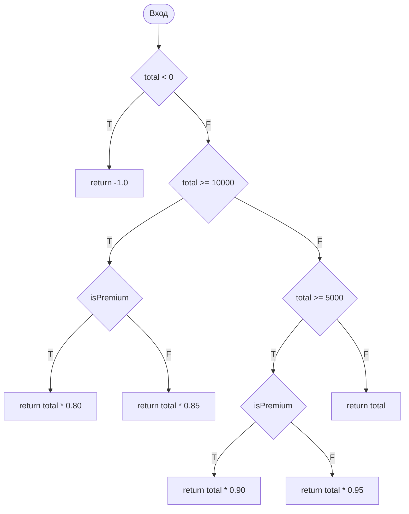
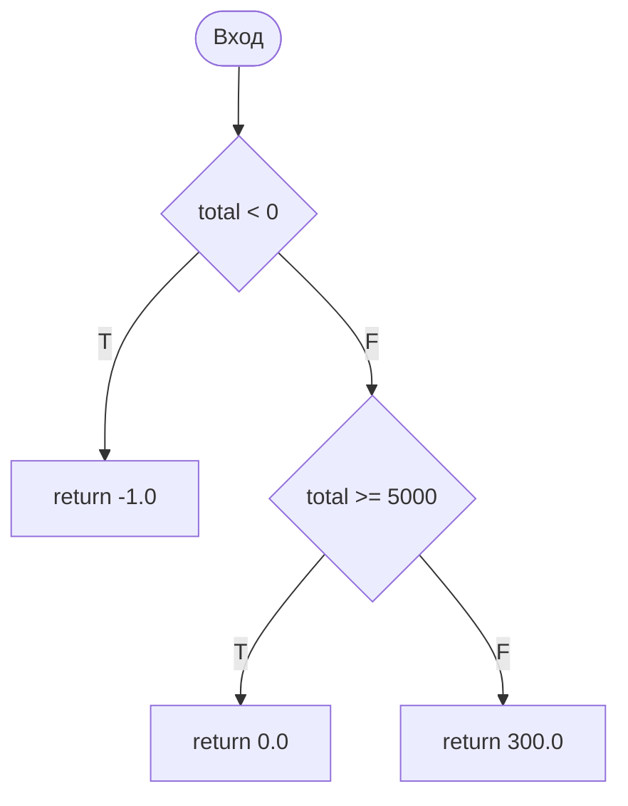
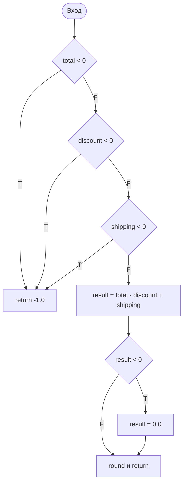
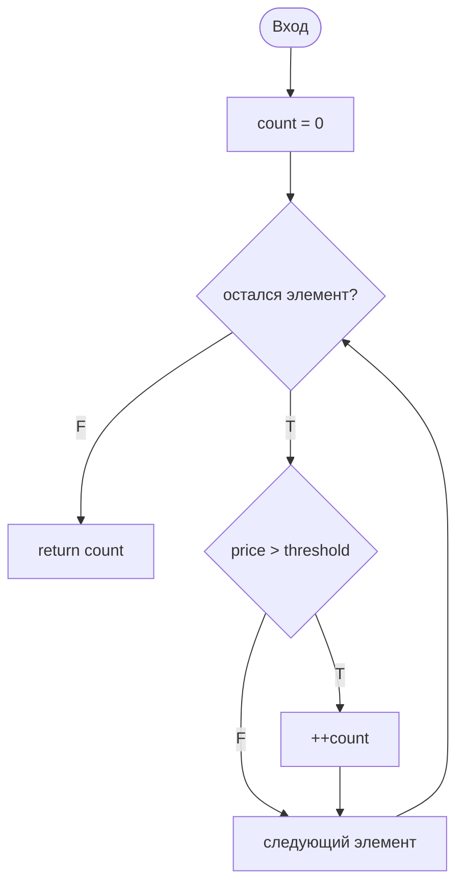
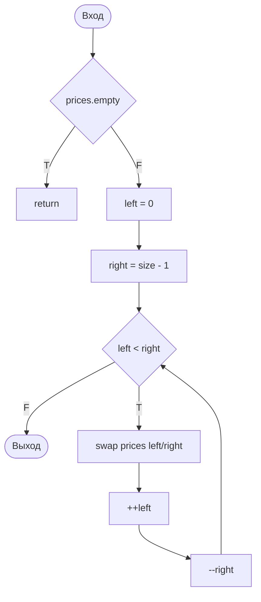
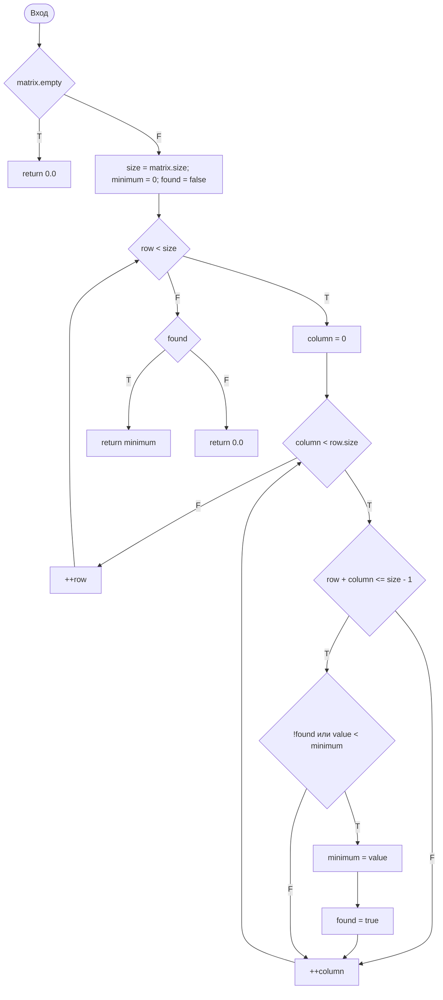

# Управляющие графы программы

Вершины с ромбом обозначают условия, прямоугольники — операторы или возврат результата. Метки `T` и `F` соответствуют истинной и ложной ветвям.

## `applyDiscount`

## `calcShipping`

## `finalPrice`

## `countExpensiveItems`

## `reversePrices` — вариант №4

## `minOnAndAboveSecondaryDiagonal` — вариант №4

